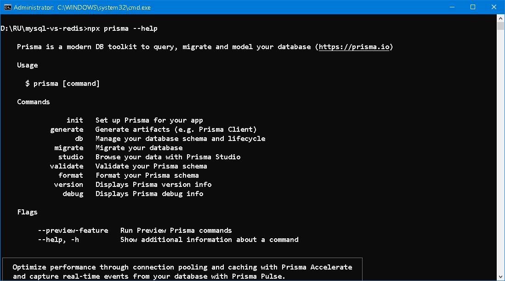
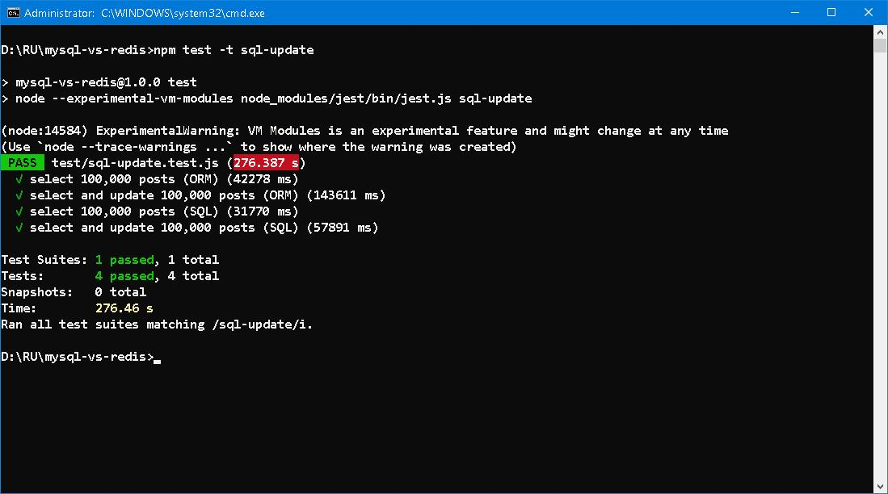
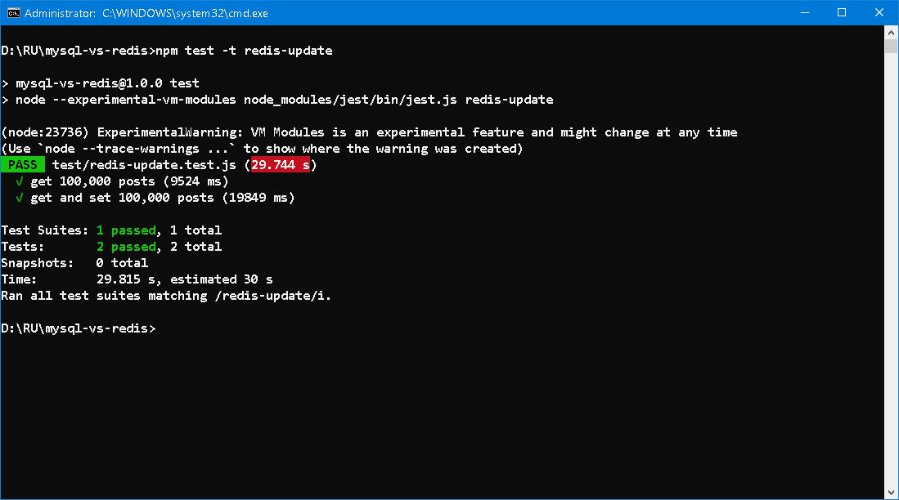
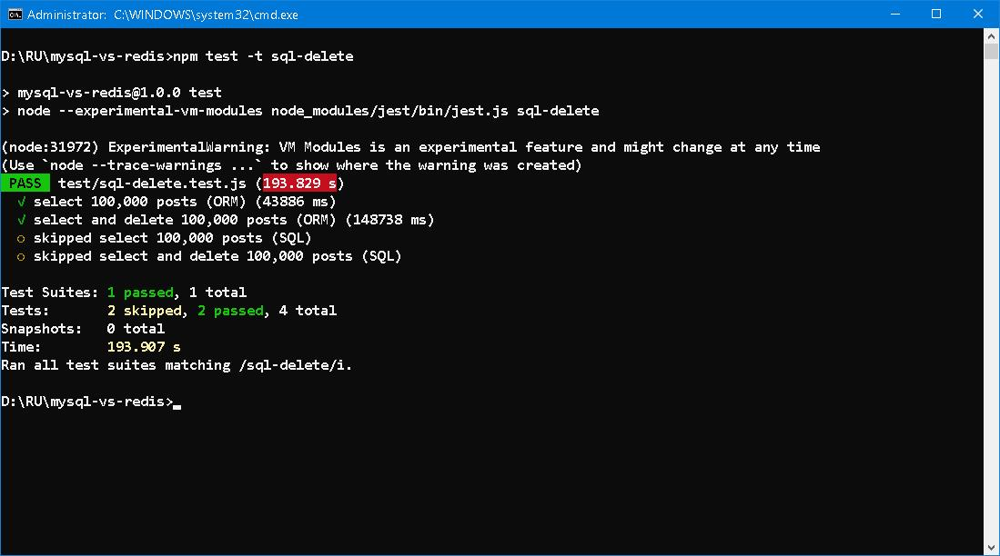
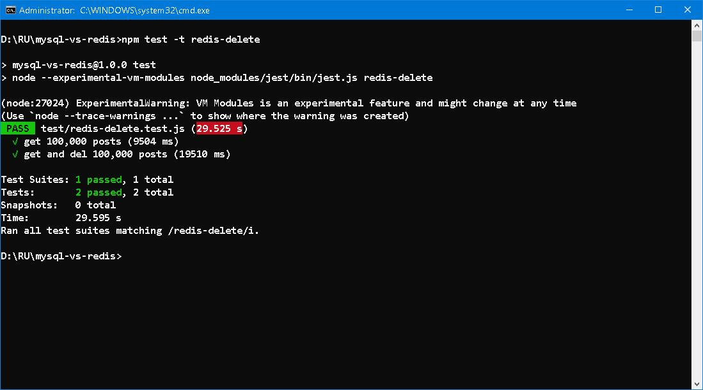
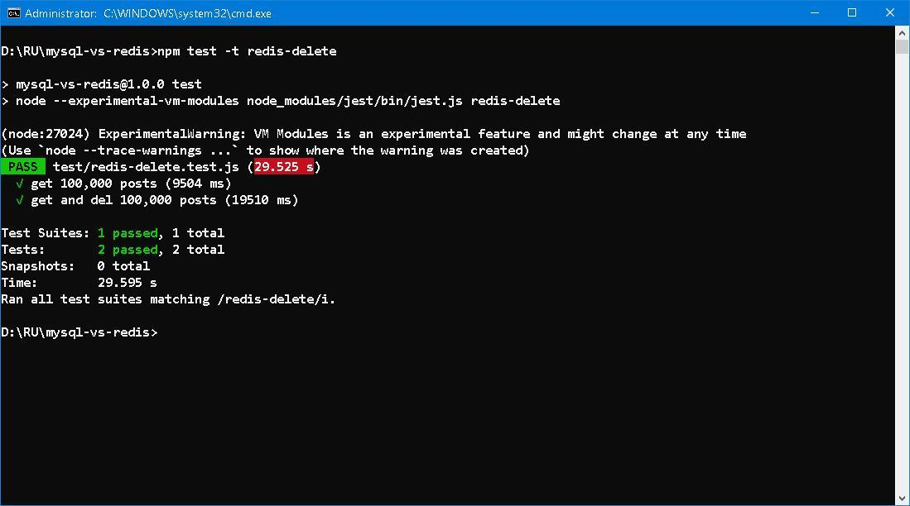
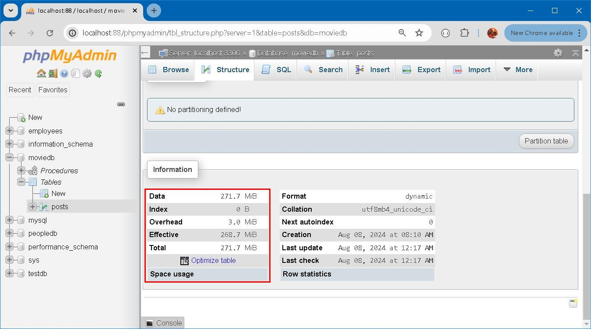
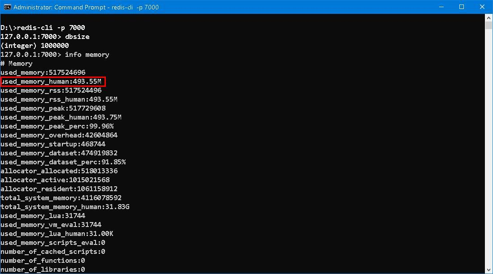

### MySQL vs Redis ─── The Match Must Goes On... 

#### Prologue 
Figures, figures, figures... More investigations have to be made to solve this riddle of figures... 

#### I. More on packages 
[Jest](https://jestjs.io/) is a delightful JavaScript Testing Framework with a focus on simplicity. [Regression testing](https://en.wikipedia.org/wiki/Regression_testing) is day-to-day life for API developers, test suite is used to facilitate and automate unit test. 

[Prisma](https://www.prisma.io/) is a mature ORM tool which supports multi-databases (one at a time manner) and full [SDLC](https://www.geeksforgeeks.org/software-development-life-cycle-sdlc/). Both Database-First and Code-First bi-directional approach are supported in model building, data migration and studio are handy tools in schema evolution. Chances are when you need raw SQL or you are SQL guru, but there may be subtle and obscure differences in [DML](https://en.wikipedia.org/wiki/Data_manipulation_language) syntax. Using ORM can lower threshold and increase portability when backend migration is needed. 

Some people has complexion on using raw SQL while others said it is *old-school* if not to opt ORM of some sort. Personally, I don't oppose to the idea of ORM but it does incur performance penalty somehow. Use it or not depends on skill set and favourite of development team. 

#### II. Read and Update 
According to Prisma [CRUD](https://www.prisma.io/docs/orm/prisma-client/queries/crud) doc, rewrite test suite and use `findUnique` instead of `findMany`. The test is extended as: 
1. To get 100,000 out of 1,000,000 posts by random (ORM/SQL);
2. To get 100,000 out of 1,000,000 posts by random and update userId, title and body fields (ORM/SQL); 

How brilliant the figures! And thanks to my M.2 SSD... The overhead on ORM update is obvious (≈ 2.3 times slower); on the other hand raw SQL update is faster than expected. Let's look at Redis: 

See! Three times faster than raw SQL, read and update at the same level. 

#### III. Read and Delete 
Let's continue with read and delete. First, ORM: 

Same performance as read and update. Then, raw SQL: 

Raw SQL delete has significant overhead, and so does insert. Let's look at Redis: 

Same performance as read and update. We can surely say that Redis is of low latency and always matches with one's expectation. 

#### IV. In terms of size
Time and space are contradictory factors. First in disk space: 

Then in RAM occupied: 

[Contine to part three](README-Part3.md)

#### Epilogue
The brain of the East, the science of the West—and two others whose identities we do not yet know. But we must find out. 

#### EOF (2024/08/09)
brilliant
