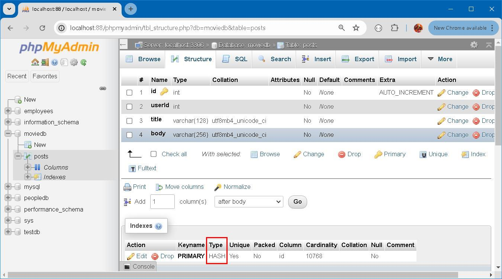
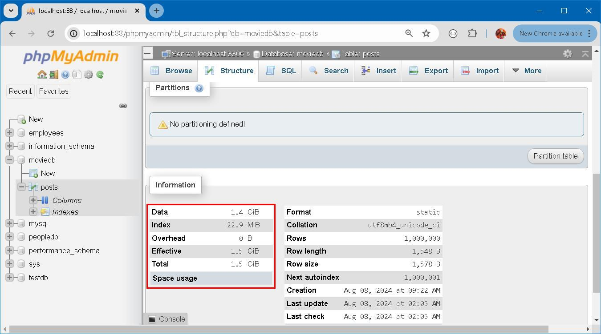
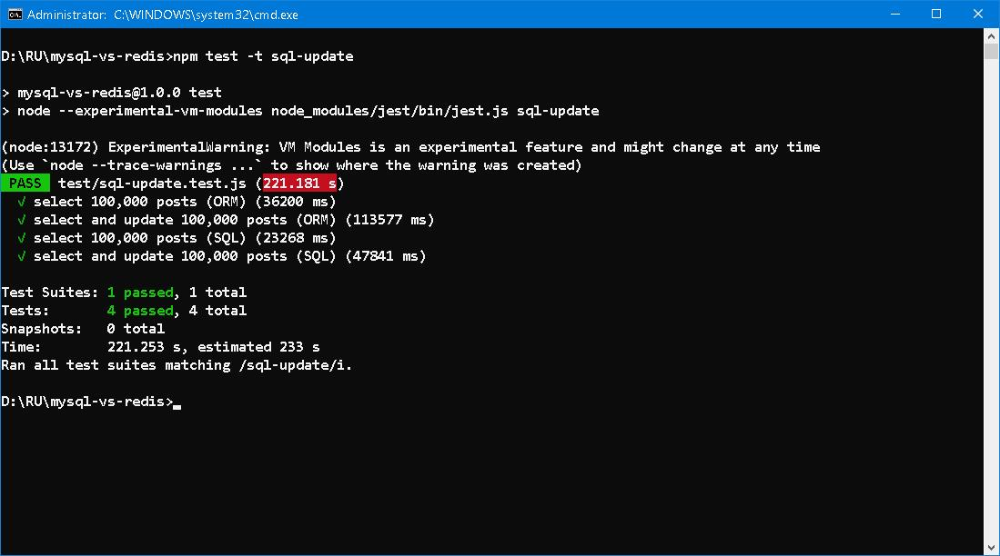
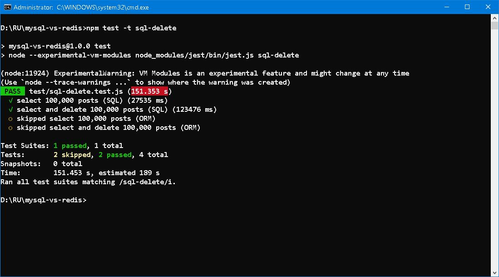
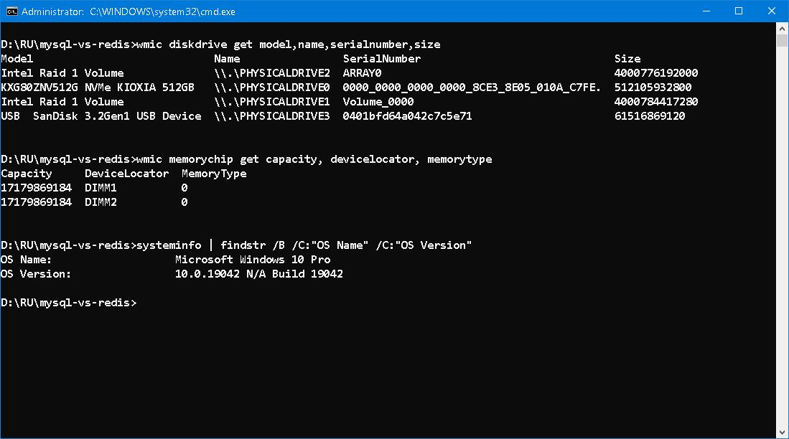

### MySQL vs Redis ─── The Final Struggle 


#### Prologue 
To quest for ultimate power, to revenge for his dead buddies, [ZX-Tole](https://guyver.fandom.com/wiki/ZX-Tole) sacrificed his glories and life to transmorph himself into [Neo ZX-Tole](https://guyver.fandom.com/wiki/Neo-ZX-Tole) in an effort to triumph over [Aptom](https://monster.fandom.com/wiki/Aptom). With overwhelming speed and forbidden weapon, he knew well that his capability is unrivalled but his days were numbered. No matter win or lose, he *must* die after all... 


#### I. Desperation
> Storage engines are MySQL components that handle the SQL operations for different table types. [InnoDB](https://dev.mysql.com/doc/refman/8.4/en/innodb-introduction.html) is the default and most general-purpose storage engine, and Oracle recommends using it for tables except for specialized use cases. (The `CREATE TABLE` statement in MySQL 8.4 creates InnoDB tables by default.)

> The [MEMORY Storage Engine](https://dev.mysql.com/doc/refman/8.4/en/memory-storage-engine.html) (formerly known as HEAP) creates special-purpose tables with contents that are stored in memory. Because the data is vulnerable to crashes, hardware issues, or power outages, only use these tables as temporary work areas or read-only caches for data pulled from other tables.

> In-memory storage for fast access and low latency. Data volume can fit entirely in memory without causing the operating system to swap out virtual memory pages.


#### II. System Setup 
To squeeze out the last drop of power, we are going to re-create `posts` table using `Memory Storage Engine`. Yes, we are going to store 1,000,000 posts in RAM! Schema has to be slightly modified since `BLOB` and `TEXT` are not supported by MEMORY. 
```
DROP TABLE posts;

CREATE TABLE posts (
    id INT PRIMARY KEY AUTO_INCREMENT,
    userId INT NOT NULL,
    title VARCHAR(128) NOT NULL,
    body VARCHAR(256) NOT NULL
) ENGINE=MEMORY;
```

Meanwhile, We need to increase heap size (default is 512M) to accommodate the data. Add the folliwing line to `my.ini` of local system: 
```
SET max_heap_table_size = 1680M;
```

Re-seed database with: 
```
npx prisma db seed 
```



Instead of `BTree`, `HASH` is used for primary key access. This is comparative to Redis. As you can see, how versatile and resourceful it is! 



Data base size is 1.5G! Crafting tables in memory is forbidden trick in RDBMS since it violates durability of [ACID](https://en.wikipedia.org/wiki/ACID) principle and is the last resort to performance demand. All data vanish if server crashed or restarted... 


#### III. Read and Update 
```
npm test -t sql-update 
```


Comparing to the figures in [Part two](README-Part2.md), around 15~25% performance gained but still twice as much in Redis. 


#### IV.  Read and Delete 
```
npm test -t sql-delete 
```


Comparing to the figures in [Part two](README-Part2.md), around 15~25% performance gained but still twice as much in Redis. 


#### V. Introspection 
Configuration of local system is: 
```
Processor	Intel(R) Core(TM) i7-9700 CPU @ 3.00GHz   3.00 GHz
Installed RAM	32.0 GB (31.8 GB usable)
System type	64-bit operating system, x64-based processor
```
With 512G M.2 SSD. 



And all tests I made, I can safely draw my conclusion: 

- Redis is 3~4 times faster than MySQL in read access; 
- Redis is 2 times faster than MySQL in read access (In-memory storage); 
- MySQL update is more or less the same level of read access; 
- MySQL delete is slower than expected and so does insert; 
- ORM has little overhead on read access; 
- ORM update and delete pose significant overhead; 


#### VI. Bibliography 
1. [18.3 The MEMORY Storage Engine](https://dev.mysql.com/doc/refman/8.4/en/memory-storage-engine.html)


#### Epilogue
"Well," she said softly, "this is the end. WE cannot permit our plans to be interfered with. Have you any last request to make?"


#### EOF (2024/08/09)
