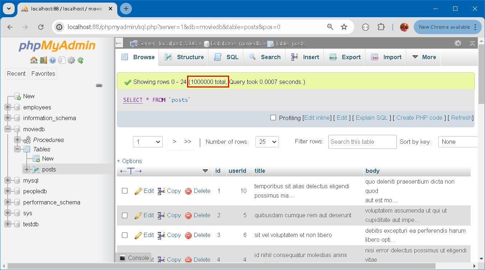
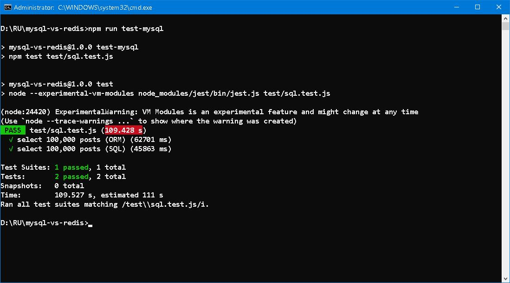

### MySQL vs Redis 


#### Prologue 
Time, as a ambiguous concept, is hard to fathom accurately. We can surely say that *sixty years is too short* and at the same time *60 seconds is too long* without any contradictions. Ever since I started learning Redis, I was told that it is very fast.... But how fast it when comparing with MySQL, for example? 


#### I. System setup 
```
npm init 
npm install ioredis prisma
npm install jest --save-dev 
```

Sample data are [100 posts](https://jsonplaceholder.typicode.com/posts) from [{JSON} Placeholder](https://jsonplaceholder.typicode.com/). I slight modify it for easy ingestion to databases. 

MySQL Version 8.0.30 and Redis Version 7.4.2 are installed locally, we choose package prisma for MySQL and ioredis for Redis. As of this writing, Choosing prisma simply because it's possible to move to other RDBMS with ease and can compare ORM and raw SQL performance. 

To begin with: 
```
npx prisma init
```

A Posts model is created in prisma/schema.prisma:
```
model Posts {
  id        Int     @id 
  userId    Int
  title     String
  body      String @db.Text
}
```

To create posts table in MySQL:
```
npx prisma db push 
```

To create Prisma Client, which is for ORM:
```
npx prisma generate 
```

Add this code fragment to package.json: 
```
  "prisma": {
    "seed": "node prisma/seed.js"
  }
```

Add seed.js to prisma folder, and to seed database with: 
```
npx prisma db seed 
```



We use hash to store posts data in Redis. No schema is necessary. A seed-redis.js is create in config folder. To seed database with: 
```
node src/config/seed-redis.js
```


#### II. Run Run Run 

#### III. Bibliography 
1. [ioredis](https://github.com/redis/ioredis)
2. [MySQL/MariaDB](https://www.prisma.io/docs/orm/overview/databases/mysql)
3. [jest](https://www.npmjs.com/package/jest?activeTab=readme)
4. [THE BIG FOUR](https://www.gutenberg.org/files/70114/70114-h/70114-h.htm)





#### Epilogue 

### EOF (2024/08/09)