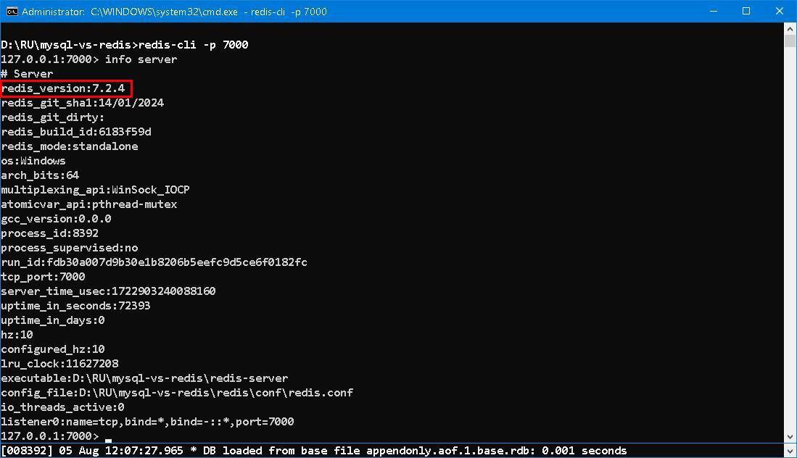
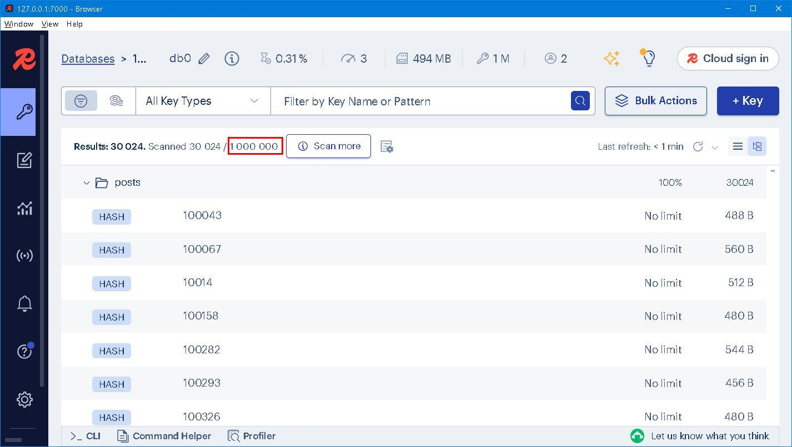
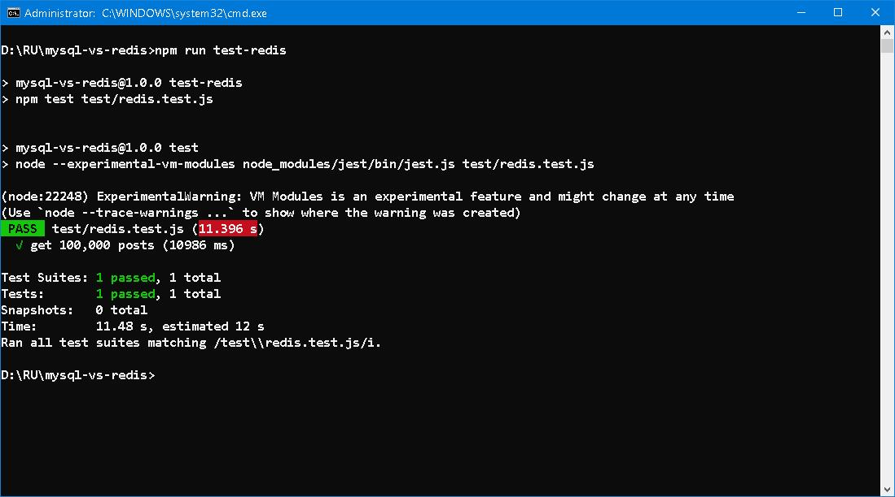

### MySQL vs Redis ─── A Match in a Million! 


#### Prologue 
Time, as an ambiguous concept, hardly can one get hold of. We can definitely say *sixty years is too short* and at the same time *60 seconds is too long* without any contradictions. It all depends on where we stand and how we view. Ever since I started learning Redis, I was told that it is very fast.... But how fast it is when comparing to [MySQL](https://www.mysql.com/), for example? IMHO, SQL Server was an ingenious invention which solves hundreds and thousands of problems in day-to-day life. What the dickens are we doing with Redis? What we gain and what we lose? These are the main subject of this article. 


#### I. System setup 
```
npm init 
npm install ioredis prisma
npm install jest --save-dev 
```

Sample data are [100 posts](https://jsonplaceholder.typicode.com/posts) from [{JSON} Placeholder](https://jsonplaceholder.typicode.com/). I slight modify it for easy ingestion. 

MySQL Version 8.0.30 and Redis Version 7.4.2 are installed locally.



Choose [prisma](https://www.npmjs.com/package/prisma) for MySQL and [ioredis](https://github.com/redis/ioredis) for Redis. Because prisma is cross-platform and we can shift to other RDBMS or compare ORM and raw SQL whenever necessary. 

To begin with: 
```
npx prisma init
```

A Posts model is created in `prisma/schema.prisma`:
```
model Posts {
  id        Int     @id 
  userId    Int
  title     String
  body      String @db.Text
}
```

To create posts table in MySQL:
```
npx prisma db push 
```

To create Prisma Client, which is for ORM:
```
npx prisma generate 
```

Add this code fragment to package.json: 
```
  "prisma": {
    "seed": "node prisma/seed-mysql.js"
  }
```

Add `seed-mysql.js` to prisma folder, and to seed database with: 
```
npx prisma db seed 
```


We use hash to store posts data in Redis. No schema is necessary. A `seed-redis.js` is create in `config` folder. To seed database with: 
```
npm run seed-redis
```




#### II. Read Test
We create 1,000,000 records in MySQL and 1,000,000 hashes in Redis. The test is based on retrieving 100,000 records/hashes via primary key by random. Repeatedly running until the yields become stable. 


I do not oppose to the idea of ORM but it does pose some overhead. Using raw SQL to select 100,000 posts is 45863 ms, 0.45863 ms per post. Which means our MySQL server can serve 2180 read requests per second in raw SQL and 1594 requests in ORM. 



In Redis, the story is different. To get 100,000 posts is 10986 ms, 0.10986 ms per post. Which means our Redis server can serve 9102 read requests per second in current setting. 

As you can see, all tests are done locally. No network latency nor routing overhead involved. The numbers are in theory but not factitious. 


#### III. introspection
Modern RDBMS index is organized in form of [B-tree](https://en.wikipedia.org/wiki/B-tree), time complexity is O(log n). As of our setting, 1,000,000 records is Log(1,000,000)/Log(2) ≈ 20. To query any record via primary key, maximum number of comparisons is 20 until the index is met or no record found. Once the location of record is acquainted, a second read is performed and record returned thereupon. Index is maintained by system and not always unpalpable, everything has its own cost in terms of space and CPU time. 

Data in RDBMS is stored closely togther, index is essential mean to enable fast access. In Redis, data is stored scatteringly, the actual location of data is obtained via calculation of key. No additional space and time on index is required and constant time access is always ensured. 

Our test shows that primary key access in Redis is four times faster than MySQL. 


#### IV. Bibliography 
1. [ioredis](https://github.com/redis/ioredis)
2. [MySQL/MariaDB](https://www.prisma.io/docs/orm/overview/databases/mysql)
3. [jest](https://www.npmjs.com/package/jest?activeTab=readme)
4. [THE BIG FOUR](https://www.gutenberg.org/files/70114/70114-h/70114-h.htm)


#### Epilogue 
Balancing the speed and flexibility of query, RDBMS such as MySQL, is always a good move. But there are some cases where speed is in predominant position, Redis would be an obvious choice. 


### EOF (2024/08/09)